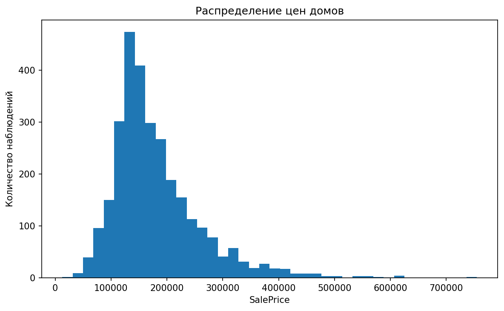
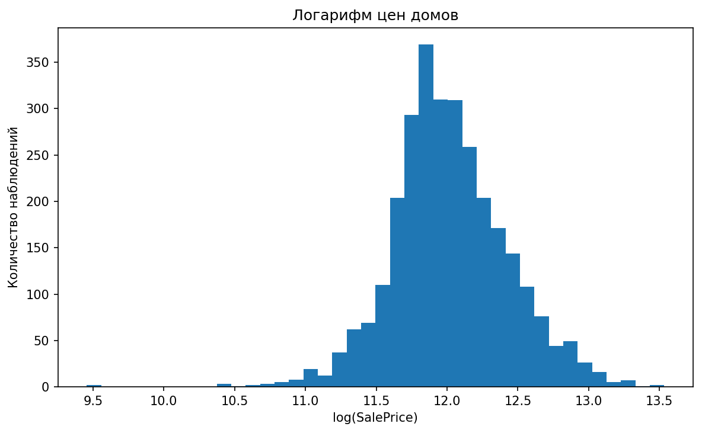
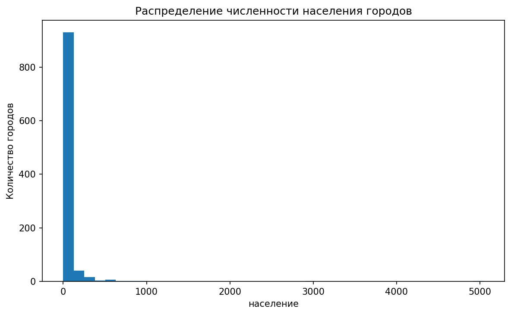
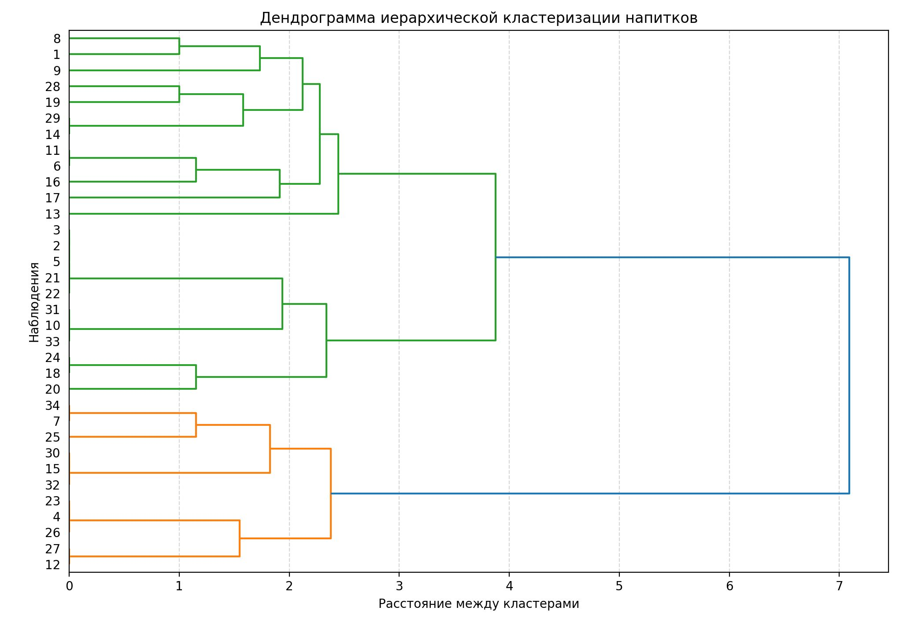

# Статистика и кластеризация

## О проекте

Этот репозиторий объединяет несколько мини-проектов, в которых акцент сделан на статистическое мышление, анализ распределений и методы обучения без учителя.

Здесь важно не просто построить график, а показать более глубокий аналитический подход:
- как понять форму распределения;
- когда среднее плохо описывает данные;
- зачем нужны устойчивые статистики;
- как визуализировать многомерные данные;
- как применять методы кластеризации для поиска структуры в данных.

## Состав проекта

### 1. `housing_price_distribution.ipynb`
Ноутбук по анализу распределения цен на жилье.  
Используется для демонстрации формы распределения, влияния асимметрии и интерпретации логарифмирования.

### 2. `robust_statistics_and_group_analysis.ipynb`
Ноутбук, в котором рассматриваются устойчивые статистики и различия между распределениями.  
Фокус — не просто посчитать среднее, а понять, когда оно уместно, а когда может искажать картину.

### 3. `hierarchical_clustering_beverages.ipynb`
Ноутбук по иерархической кластеризации данных о предпочтениях напитков.  
Здесь показан подход к анализу похожести объектов и выделению групп без заранее заданных меток.

## Используемые файлы

- Ноутбуки:
  - `housing_price_distribution.ipynb`
  - `robust_statistics_and_group_analysis.ipynb`
  - `hierarchical_clustering_beverages.ipynb`
- Данные:
  - `data/ames_housing.txt`
  - `data/russian_towns_1959.csv`
  - `data/swiss_bank_notes.csv`
  - `data/beverage_ratings.csv`

## Структура папки

```text
statistics-and-clustering/
├── README.md
├── README_images.md
├── housing_price_distribution.ipynb
├── robust_statistics_and_group_analysis.ipynb
├── hierarchical_clustering_beverages.ipynb
├── data/
│   ├── ames_housing.txt
│   ├── russian_towns_1959.csv
│   ├── swiss_bank_notes.csv
│   └── beverage_ratings.csv
└── images/
    ├── ames_saleprice_distribution.png
    ├── ames_log_saleprice_distribution.png
    ├── town_population_distribution.png
    └── beverage_scatter.png
```

## Что сделано в проекте

- проанализированы распределения и их асимметрия;
- рассмотрены устойчивые статистики;
- показаны визуализации многомерных данных;
- выполнен пример иерархической кластеризации;
- продемонстрирована интерпретация результатов без заранее заданных меток.

## Почему проект важен

Этот проект подчеркивает аналитическую зрелость, потому что в нем акцент сделан не только на технике, но и на корректности интерпретации.  
Он показывает, что я умею:
- замечать, когда данные ведут себя не по учебнику;
- выбирать адекватные статистические инструменты;
- интерпретировать структуру многомерных наблюдений;
- использовать unsupervised learning для поиска закономерностей.

## Какие навыки показывает проект

- статистическое мышление;
- анализ распределений;
- EDA;
- иерархическая кластеризация;
- интерпретация многомерных данных;
- базовое применение методов обучения без учителя.

## Визуализации








